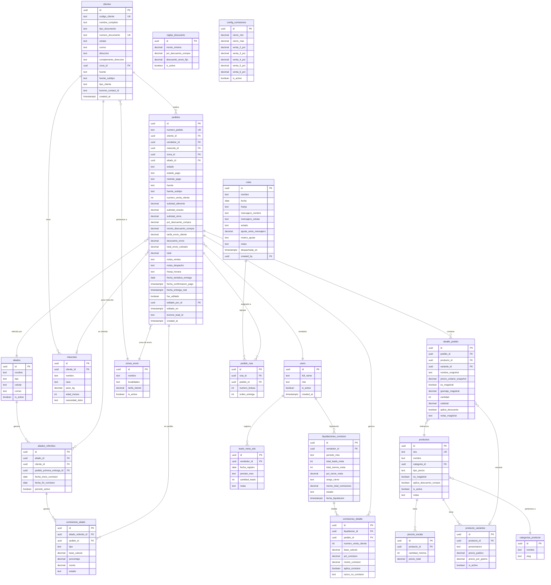

# 🏗️ AMATU ERP — Master Plan de Desarrollo
## Fase 1 + Motor de Comisiones

> Stack: Next.js (App Router) · TypeScript · Tailwind CSS · shadcn/ui · Supabase (PostgreSQL + Auth) · Zustand · n8n · Kommo API

---

## 1. Modelo Entidad-Relación (MER)

### 1.1 Diagrama



### 1.2 Enums PostgreSQL

| Campo | Valores |
|---|---|
| `users.role` | `admin`, `vendedor`, `logistica`, `contable` |
| `clientes.tipo_documento` | `CC`, `CE`, `NIT`, `Pasaporte` |
| `clientes.tipo_cliente` | `publico`, `distribuidor` |
| `clientes.fuente` | `meta_ads`, `referido_cliente`, `referido_veterinario`, `referido_entrenador`, `distribuidor`, `otro` |
| `pedidos.estado` | `fecha_tentativa`, `confirmado`, `en_preparacion`, `espera_produccion`, `listo_despacho`, `despachado`, `devolucion`, `parcial` |
| `pedidos.estado_pago` | `pendiente`, `confirmado` |
| `pedidos.metodo_pago` | `nequi`, `daviplata`, `efectivo`, `bancolombia`, `pse_openpay`, `bold`, `contraentrega` |
| `pedidos.franja_horaria` | `AM`, `PM`, `intermedia`, `sin_franja` |
| `productos.tipo_precio` | `fijo`, `por_variante`, `por_gramo`, `escala` |
| `rutas.franja` | `AM`, `PM`, `intermedia` |
| `rutas.estado` | `en_preparacion`, `despachada` |
| `liquidaciones_comision.estado` | `borrador`, `cerrado`, `pagado` |
| `aliados.tipo` | `veterinario`, `entrenador_canino`, `otro` |
| `comisiones_aliado.tipo` | `primera_compra`, `recompra` |
| `comisiones_aliado.estado` | `pendiente`, `liquidada` |

### 1.3 Lógica de Base de Datos (Triggers y Funciones)

| Trigger / Función | Propósito |
|---|---|
| `fn_generar_numero_pedido()` | Auto-genera `AMT-YYYY-NNNN` al insertar pedido |
| `fn_calcular_numero_venta_cliente()` | Cuenta pedidos previos confirmados del cliente, asigna `numero_venta_cliente` |
| `fn_actualizar_periodo_aliado()` | Recalcula `periodo_activo` en `aliados_referidos` diariamente (pg_cron) |
| `fn_aplicar_descuentos()` | Calcula descuentos según `reglas_descuento` al confirmar pedido |

### 1.4 Row Level Security (RLS)

| Tabla | Admin | Vendedor | Logística | Contable |
|---|---|---|---|---|
| `pedidos` | Full | SELECT all + INSERT/UPDATE propio (antes de listo_despacho) | SELECT confirmados+ | SELECT all |
| `clientes` | Full | Full | SELECT | SELECT |
| `rutas` | Full | — | Full | SELECT |
| `comisiones_detalle` | Full | SELECT propio | — | Full |
| `liquidaciones_comision` | Full | SELECT propio | — | Full |
| `estado_pago` en pedidos | Full | — | — | UPDATE only |

---

## 2. Arquitectura de Carpetas — Next.js App Router

```
src/
├── app/
│   ├── (auth)/
│   │   ├── login/page.tsx
│   │   └── layout.tsx
│   ├── (dashboard)/
│   │   ├── layout.tsx                  ← Sidebar + Navbar + RoleGuard
│   │   ├── dashboard/page.tsx          ← Resumen general
│   │   ├── ventas/
│   │   │   ├── page.tsx                ← Lista de pedidos (todos los roles)
│   │   │   ├── nueva/page.tsx          ← Módulo de toma de pedido (carrito)
│   │   │   └── [id]/page.tsx           ← Detalle del pedido
│   │   ├── clientes/
│   │   │   ├── page.tsx                ← Lista + búsqueda
│   │   │   ├── nuevo/page.tsx
│   │   │   └── [id]/page.tsx           ← Perfil cliente + mascotas + historial
│   │   ├── catalogo/
│   │   │   ├── page.tsx                ← Grid de productos
│   │   │   ├── [id]/page.tsx           ← Editar producto / variantes
│   │   │   └── magistrales/page.tsx    ← Dietas magistrales guardadas
│   │   ├── logistica/
│   │   │   ├── page.tsx                ← Kanban de pedidos confirmados
│   │   │   ├── rutas/
│   │   │   │   ├── page.tsx            ← Armar/gestionar rutas del día
│   │   │   │   └── [id]/page.tsx       ← Detalle de ruta + liquidación mensajero
│   │   │   └── etiquetas/page.tsx      ← Previsualización PDF etiquetas
│   │   ├── comisiones/
│   │   │   ├── page.tsx                ← Dashboard vendedor (mes actual)
│   │   │   ├── liquidaciones/page.tsx  ← Historial de liquidaciones
│   │   │   ├── leads/page.tsx          ← Ingreso manual leads Meta Ads
│   │   │   └── aliados/page.tsx        ← Tracking comisiones veterinarios
│   │   └── admin/
│   │       ├── usuarios/page.tsx
│   │       ├── config/
│   │       │   ├── descuentos/page.tsx ← CRUD reglas_descuento
│   │       │   ├── envios/page.tsx     ← CRUD zonas_envio
│   │       │   └── comisiones/page.tsx ← CRUD config_comisiones
│   │       └── aliados/page.tsx        ← CRUD aliados (vets/partners)
│   ├── api/
│   │   ├── despachar-ruta/route.ts     ← Payload n8n + Kommo stage move
│   │   └── comisiones/calcular/route.ts
│   ├── layout.tsx
│   └── globals.css
├── components/
│   ├── ui/                             ← shadcn/ui (auto-generado)
│   ├── ventas/
│   │   ├── CartPanel.tsx               ← Panel del carrito (Zustand)
│   │   ├── ProductSearchBox.tsx
│   │   ├── OrderSummaryCard.tsx        ← Totales + descuentos aplicados
│   │   ├── ShippingZonePicker.tsx
│   │   └── PaymentConfirmDialog.tsx
│   ├── clientes/
│   │   ├── ClientForm.tsx
│   │   ├── MascotaForm.tsx
│   │   └── ClientHistoryTable.tsx
│   ├── logistica/
│   │   ├── KanbanBoard.tsx
│   │   ├── KanbanCard.tsx
│   │   ├── RutaBuilder.tsx
│   │   └── ShippingLabel.tsx           ← react-pdf template
│   ├── comisiones/
│   │   ├── CommissionSummaryCard.tsx
│   │   ├── CommissionTable.tsx
│   │   └── MetaLeadsForm.tsx
│   └── shared/
│       ├── Sidebar.tsx
│       ├── Navbar.tsx
│       ├── RoleGuard.tsx
│       └── StatusBadge.tsx
├── lib/
│   ├── supabase/
│   │   ├── client.ts                   ← Browser client
│   │   └── server.ts                   ← Server client (RSC)
│   ├── calculators/
│   │   ├── discounts.ts                ← Motor de descuentos
│   │   ├── shipping.ts                 ← Cálculo de envío por zona
│   │   ├── magistral.ts                ← Pricing dietas magistrales
│   │   └── commissions.ts              ← Motor de comisiones
│   ├── integrations/
│   │   ├── kommo.ts                    ← Kommo API (mover stages)
│   │   └── n8n.ts                      ← Builder payload mensajero
│   └── utils.ts
├── stores/
│   └── cartStore.ts                    ← Zustand: carrito de ventas
├── hooks/
│   ├── useAuth.ts
│   ├── useCart.ts
│   └── usePermissions.ts
├── types/
│   ├── database.types.ts               ← Generado por Supabase CLI
│   └── index.ts                        ← Tipos de negocio
└── middleware.ts                       ← Supabase auth session refresh
```

---

## 3. Roadmap de Desarrollo — Secuencia de Sprints

### Sprint 0 — Setup del Proyecto *(~1 sesión)*
- [ ] `npx create-next-app` con TypeScript + Tailwind en `./`
- [ ] Instalar shadcn/ui y configurar `components.json`
- [ ] Instalar dependencias: `zustand`, `date-fns`, `react-pdf`, `lucide-react`
- [ ] Configurar Supabase client (browser + server + middleware)
- [ ] Crear estructura de carpetas base
- [ ] Variables de entorno `.env.local`

---

### Sprint 1 — Base de Datos y Auth *(~2 sesiones)*
- [ ] **Migración 001:** Enums PostgreSQL
- [ ] **Migración 002:** Tablas maestras (`users`, `zonas_envio`, `categorias_producto`, `reglas_descuento`, `config_comisiones`)
- [ ] **Migración 003:** Catálogo (`productos`, `producto_variantes`, `precios_escala`)
- [ ] **Migración 004:** Clientes y mascotas (`clientes`, `mascotas`, `aliados`, `aliados_referidos`)
- [ ] **Migración 005:** Pedidos (`pedidos`, `detalle_pedido`)
- [ ] **Migración 006:** Logística (`rutas`, `pedido_ruta`)
- [ ] **Migración 007:** Comisiones (`leads_meta_ads`, `liquidaciones_comision`, `comisiones_detalle`, `comisiones_aliado`)
- [ ] **Migración 008:** Triggers (`fn_generar_numero_pedido`, `fn_calcular_numero_venta_cliente`)
- [ ] **Migración 009:** RLS policies por tabla y rol
- [ ] **Seed:** Zonas de envío, reglas de descuento 2026, config de comisiones, categorías
- [ ] Configurar Supabase Auth (email/password, sin signup público)
- [ ] `npx supabase gen types` → `database.types.ts`

---

### Sprint 2 — Auth UI + Layout Base *(~1 sesión)*
- [ ] Página de login (`/login`)
- [ ] Middleware de sesión y redirección
- [ ] Layout del dashboard (Sidebar + Navbar)
- [ ] Navegación condicional por rol (`RoleGuard`)
- [ ] Página de dashboard inicial (placeholder)

---

### Sprint 3 — Módulo de Catálogo *(~1 sesión)*
- [ ] Listado de productos con filtros por categoría
- [ ] CRUD de productos y variantes (Admin)
- [ ] Lógica de precios por escala (bolsas de popó)
- [ ] Flujo de creación de dieta magistral (con cálculo de precio)
- [ ] `lib/calculators/magistral.ts`

---

### Sprint 4 — Módulo de Clientes *(~1 sesión)*
- [ ] Listado de clientes con búsqueda
- [ ] Formulario de creación/edición de cliente
- [ ] Sub-formulario de mascotas
- [ ] Perfil del cliente: historial de pedidos + número de compra + mascotas
- [ ] Indicador de período activo de aliado referidor

---

### Sprint 5 — Módulo de Ventas (Motor Principal) *(~3 sesiones)*
- [x] **5a — Carrito (Zustand):** `cartStore.ts` con items, cantidades, notas
- [x] **5a — UI:** `ProductSearchBox`, `CartPanel`, selector de cliente y mascota
- [x] **5b — Motor de descuentos:** `lib/calculators/discounts.ts`
  - Calcula subtotal de alimento vs. otros
  - Aplica `reglas_descuento` automáticamente por monto
  - Aplica descuento de envío ($7.000)
  - Aplica descuento de distribuidor si `tipo_cliente = distribuidor`
- [x] **5b — Motor de envío:** `lib/calculators/shipping.ts`
  - Selección de zona → tarifa fija
  - Aplicación del descuento de envío si aplica
- [x] **5c — `OrderSummaryCard`:** Muestra subtotales, descuentos aplicados, total final
- [x] **5c — Confirmación de pedido:** Selección de método de pago, fuente, notas
- [x] **5c — Listado de pedidos:** Con filtros por estado, vendedor, fecha
- [x] **5c — Detalle de pedido:** Vista + edición (con marca `[EDITADO]`)

---

### Sprint 6 — Motor de Comisiones *(~2 sesiones)*
- [ ] **6a — Lógica:** `lib/calculators/commissions.ts`
  - Determina si aplica comisión (venta #1, distribuidor, fuente, etc.)
  - Lee `config_comisiones` para obtener % según rango de cierre
  - Calcula base: `(total - envío) × 0.95`
- [ ] **6a — Leads Meta Ads:** Formulario manual de ingreso (`/comisiones/leads`)
- [ ] **6a — Cálculo en tiempo real del % de cierre del mes**
- [ ] **6b — Dashboard del vendedor:** Cards con comisiones del mes, estado por pedido
- [ ] **6b — Liquidación mensual:** Vista Admin/Contable para cerrar el mes
- [ ] **6b — Tracking aliados:** Tabla con período activo, comisiones por aliado

---

### Sprint 7 — Módulo de Logística (Kanban) *(~2 sesiones)*
- [ ] **7a — Kanban Board:** Columnas por estado (Confirmado → En Preparación → Listo → Despachado)
- [ ] **7a — KanbanCard:** Datos del pedido, badge de espera de producción, acción de mover estado
- [ ] **7a — Ingreso de bolsas físicas** por pedido al momento de preparar
- [ ] **7b — RutaBuilder:** Selección de pedidos → asignación a ruta (mensajero, franja, fecha)
- [ ] **7b — Liquidación diaria de mensajero:** Totales por ruta, ajustes manuales
- [ ] **7b — Etiqueta de despacho PDF:** Template `ShippingLabel.tsx` con react-pdf

---

### Sprint 8 — Integración n8n + Kommo *(~1.5 sesiones)*
- [ ] **`lib/integrations/n8n.ts`:** Función `buildRutaPayload(ruta)` → objeto con array de pedidos formateados
- [ ] **`api/despachar-ruta/route.ts`:** POST → envía payload a webhook n8n → marca ruta como `despachada`
- [ ] **`lib/integrations/kommo.ts`:** Función `moveLeadToStage(kommoLeadId, stageId)` → Kommo API REST
- [ ] Al despachar: llama Kommo API por cada pedido para mover el lead al stage de "en camino"
- [ ] Test del flujo completo: Despachar → n8n recibe → WhatsApp mensajero OK → Kommo stage actualizado

---

### Sprint 9 — Panel Admin + Pulido Final *(~1 sesión)*
- [ ] CRUD de usuarios y roles (`/admin/usuarios`)
- [ ] CRUD de reglas de descuento (`/admin/config/descuentos`)
- [ ] CRUD de zonas de envío (`/admin/config/envios`)
- [ ] CRUD de config de comisiones (`/admin/config/comisiones`)
- [ ] CRUD de aliados/veterinarios (`/admin/aliados`)
- [ ] Revisión general de UX, responsive, estados vacíos
- [ ] Seguridad: validar RLS, verificar acceso por rol en todas las rutas

---

## 4. Decisiones de Arquitectura Clave

| Decisión | Elección | Razón |
|---|---|---|
| Estado del carrito | Zustand | Persistencia entre navegación, sin prop-drilling |
| Descuentos | Calculados en el cliente (TS) + guardados como snapshot en BD | Auditoría + performance |
| `numero_venta_cliente` | Trigger PostgreSQL al insertar pedido | Garantiza consistencia sin race condition |
| Comisiones mensuales | Liquidación manual (Admin cierra el mes) | Permite correcciones antes de pagar |
| PDF de etiquetas | react-pdf en frontend | No requiere servidor para generación |
| Auth | Supabase Auth + middleware session refresh | Integración nativa con RLS |
| Mensajes al cliente | Kommo API (mover stage) | Reutiliza automatizaciones ya configuradas |

---

## 5. Variables de Entorno Necesarias

```env
NEXT_PUBLIC_SUPABASE_URL=
NEXT_PUBLIC_SUPABASE_ANON_KEY=
SUPABASE_SERVICE_ROLE_KEY=        # Solo en server/API routes
N8N_WEBHOOK_URL=
N8N_WEBHOOK_SECRET=
KOMMO_ACCOUNT_DOMAIN=             # ej: amatu.kommo.com
KOMMO_ACCESS_TOKEN=
KOMMO_STAGE_EN_CAMINO_ID=         # ID del stage en Kommo
```

---

## 6. Orden de Ejecución de Sprints (Dependencias)

```
Sprint 0 (Setup)
    └─► Sprint 1 (DB + Auth)
            └─► Sprint 2 (Auth UI)
                    ├─► Sprint 3 (Catálogo)
                    ├─► Sprint 4 (Clientes)
                    └─► Sprint 5 (Ventas) ← depende de 3 y 4
                            ├─► Sprint 6 (Comisiones) ← depende de 5
                            └─► Sprint 7 (Logística) ← depende de 5
                                    └─► Sprint 8 (n8n + Kommo) ← depende de 7
                                            └─► Sprint 9 (Admin + Polish)
```
